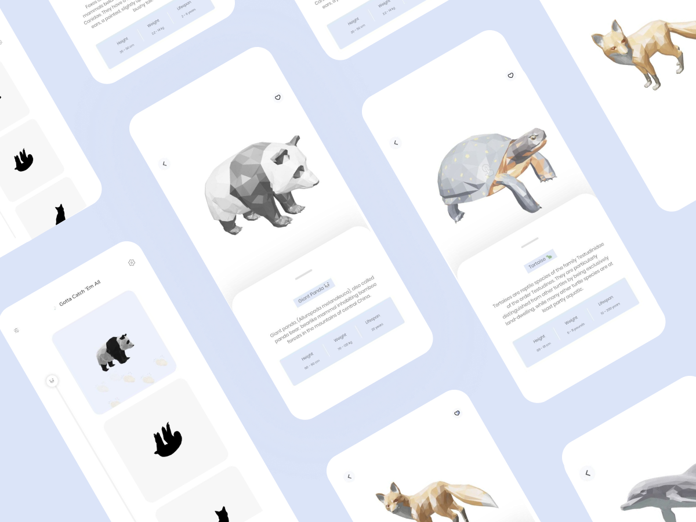
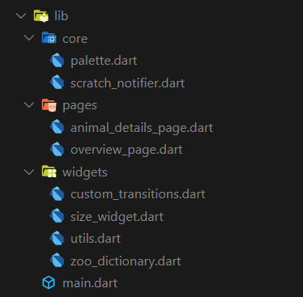

[](https://github.com/Shadow60539/zoo_app)
[](https://codemagic.io/apps/60c09ae29415820f86e53a95/60c09ae29415820f86e53a94/latest_build)
[](https://github.com/Shadow60539/zoo_app/actions/workflows/build.yml)





### Introduction 🐼

> Zoo
is a small, simple and beautiful app that lists 3d model of animals.

Before we start, you can take a look at the app:


### Usage 🎨

To clone and run this application, you'll need [git](https://git-scm.com) and [flutter](https://flutter.dev/docs/get-started/install) installed on your computer. From your command line:

```bash
# Clone this repository
$ git clone https://github.com/Shadow60539/zoo_app.git

# Go into the repository
$ cd zoo_app.git

# Install dependencies
$ flutter packages get

# Run the app
$ flutter run
```


### Packages 📦


Some very good packages are used in the project.


Package | Description
---|---
[model_viewer](https://pub.flutter-io.cn/packages/model_viewer) | 3D Model Viewer for Flutter
[flutter_svg](https://pub.flutter-io.cn/packages/flutter_svg) | Support svg files
[lottie](https://pub.flutter-io.cn/packages/lottie) | Lottie files animations
[google_fonts](https://pub.flutter-io.cn/packages/google_fonts) | Google fonts 
[lint](https://pub.flutter-io.cn/packages/lint) | Rules handler for Dart
[scratcher](https://pub.flutter-io.cn/packages/scratcher) | Scratch card widget

### Directory Structure 🏢

The project directory structure is as follows:

```
├── android
├── asset
├── build
├── images
├── ios
├── lib
├── pubspec.lock
├── pubspec.yaml

```




Directory | Description
---|---
core | `Palette`, `ScratchNotifier`
pages | `OverViewPage`, `AnimalDetailsPage`
widgets | `Transition`, `MeasureSizeRenderObject`, `ZooDictionary`, `Utils`
